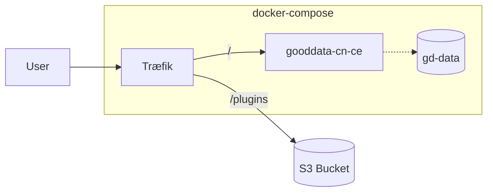

# GoodData CN CE with dashboard plugins on external service

This demo shows how to use GoodData CN CE container with Dashboard plugins hosted on remote
web server. Due to security restrictions imposed by modern browsers (CORS, CSP), it may be
problematic to use remotely hosted resources for extending GoodData CN functionality.

This situation is especially problematic for Dashboard Plugins that need to be dynamically
loaded into Dashboards app, that currently doesn't support custom CORS and CSP in GoodData CN CE.

## Installation
You only need [docker-compose](https://docs.docker.com/compose/install/). There's slight confusion
with Docker Compose versions and command names. It's possible to install `compose` as docker plugin
or as a standalone binary. Depending on the installation method you chose, the command needs to be
invoked either as `docker-compose` (standalone) or `docker compose` (plugin). Both these commands
are equivalent. In the following text, I will use `docker-compose`.

## Solution overview
Assuming the `gooddata-cn-ce` container runs on domain *A* and dashboard plugins run on domain *B*,
browser disallows loading scripts from domain *B* by scripts started from domain *A*, unless it is
explicitly allowed by CORS. The solution proposed below bypass this issue by proxying resources from
*B* domain as they are actually hosted on domain *A*. We will use Traefik proxy for this purpose.



There are two examples how the solution can be used by customers.

**Example 1** mimics regular developer usecase as if the user starts gooddata-cn-ce directly using
`docker run`. It serves the GoodData CN on http://localhost:3000/, but incorporates the remote
S3 bucket resources in http://localhost:3000/plugins/ URL prefix.

**UPDATE**: This example will **NOT** work with dashboard plugins because plugins
are required to be download from HTTPS-enabled endpoint. But it may be useful
for other purposes.

**Example 2** is more complex. It assumes the whole application runs on public endpoint
https://analytics.example.com:3443/, so the assets stored in S3 bucket are accessible in
https://analytics.example.com:3443/plugins/ URL prefix. This example contains SSL key and certificate
signed by fake self-signed Certification Authority (CA certificate is also in this repo, so if you want
to suppress SSL warnings, you can [import it](example2/ca.crt) to your browser). For more serious usage, key and certificates
should be replaced by real trusted ones.

Both examples expose additional endpoint http://localhost:8080/dashboard/#/ where the Traefik dashboard
is enabled.

### Example 1: Running on localhost (http)
Start Compose stacK:
```bash
cd example1
docker-compose up
```


### Example 2: Running on public hostname (https)
If you want to run this example locally, add `analytics.example.com` as alias to `127.0.0.1` in your `/etc/hosts` file.
Also, you may import CA certificate to your browser to suppress annoying "insecure page" errors.

```bash
cd example2
docker-compose up
```

## How it actually works?
Docker Compose starts Traefik and GoodData CN CE. Traefik has main config file [traefik.yml](example2/traefik/traefik.yml) that sets up
logging and entrypoints (on which TCP ports Traefik will listen). It also defines two `providers`, that
will deliver additional configuration.

Docker provider listens for events on docker daemon using unix-domain socket. When new container is startes
and comes up, Traefik reads contianer configuration (name, ports, labels). Based on these facts, traefik
config is dynamically updated and new routers, services, rules, and middlewares are created. Review
container labels on gooddata-cn-ce in docker-compose.yml file how the configuration looks like.

File provider uses precreated file [config.yml](example2/traefik/config.yml) to configure router for external service (S3 bucket). When
rule matches the request comming from an entrypoint, it's passed through middleware stack before it is
sent to service `plugins` that finally delivers the request to server url defined in `plugins` service.

Currently, only one middleware `plugins-prefix` is used and it is responsible for replacing URI path.
Additional middlewares are defined, but unused. They are just examples for future development.
